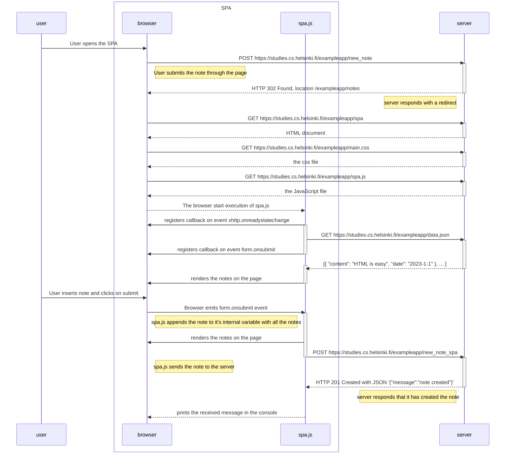

# SPA New Note diagram

```mermaid
sequenceDiagram

    participant user
    box SPA
    participant browser
    participant spa.js
    end
    participant server

    user->>browser: User opens the SPA
    browser->>server: POST https://studies.cs.helsinki.fi/exampleapp/new_note
    activate server
    Note right of browser: User submits the note through the page
    server-->>browser: HTTP 302 Found, location /exampleapp/notes
    deactivate server
    Note left of server: server responds with a redirect

    browser->>server: GET https://studies.cs.helsinki.fi/exampleapp/spa
    activate server
    server-->>browser: HTML document
    deactivate server

    browser->>server: GET https://studies.cs.helsinki.fi/exampleapp/main.css
    activate server
    server-->>browser: the css file
    deactivate server

    browser->>server: GET https://studies.cs.helsinki.fi/exampleapp/spa.js
    activate server
    server-->>browser: the JavaScript file
    deactivate server

    browser-->>spa.js: The browser start execution of spa.js

    spa.js->>browser: registers callback on event xhttp.onreadystatechange
    activate spa.js
    spa.js->>server: GET https://studies.cs.helsinki.fi/exampleapp/data.json
    activate server
    spa.js->>browser: registers callback on event form.onsubmit
    deactivate spa.js

    server-->>spa.js: [{ "content": "HTML is easy", "date": "2023-1-1" }, ... ]
    activate spa.js
    deactivate server
    spa.js->>browser: renders the notes on the page
    deactivate spa.js

    user->>browser: User inserts note and clicks on submit
    browser->>spa.js: Browser emits form.onsubmit event
    activate spa.js
    Note left of spa.js: spa.js appends the note to it's internal variable with all the notes
    spa.js->>browser: renders the notes on the page

    spa.js->>server: POST https://studies.cs.helsinki.fi/exampleapp/new_note_spa
    deactivate spa.js
    activate server
    Note right of browser: spa.js sends the note to the server
    server-->>spa.js: HTTP 201 Created with JSON '{"message":"note created"}'
    deactivate server
    Note left of server: server responds that it has created the note
    spa.js-->>browser: prints the received message in the console

```
